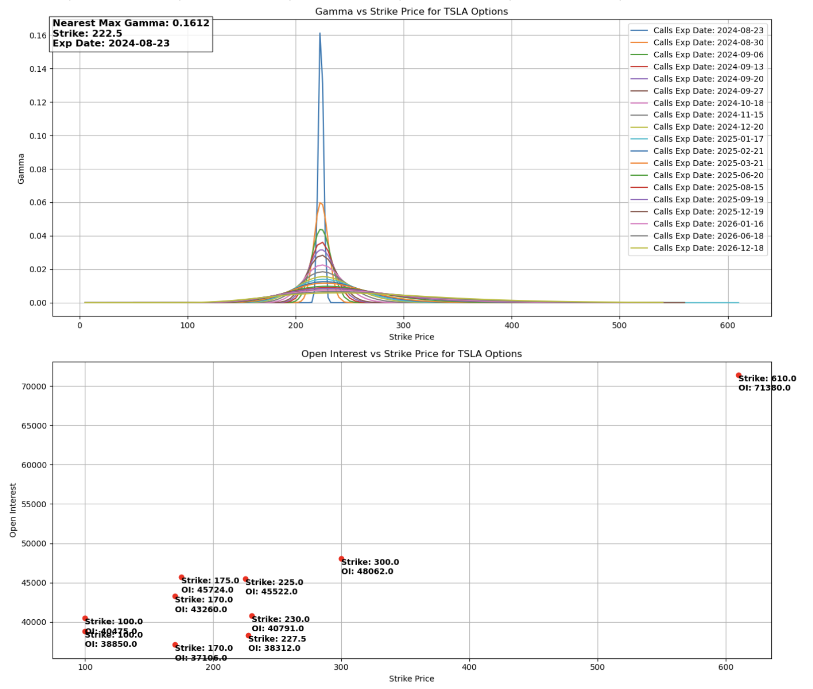

今天在用chatGPT解决了自动生成文件.DS-Store的设置问题后，第一次试着用chatGPT和Copilot来写代码，先是让它们写了一段在tradingview上显示6条均线，且相邻两条均线之间有颜色填充的代码，实测只需要稍微调整一下就完全满足要求。可能对程序员来说这不算啥，对我这个原本想学一门计算机语言的人来说，既兴奋也很受打击。兴奋的是写代码有它们帮手，那不是一件很容易的事吗？受打击的是，对我这技术纯白来说，学几年也不能达到什么程序都能写的水平啊。这个指标的显示效果如下：

接着我又用对话的方式让chatGPT写了一段python代码，从雅虎抓取数据，显示某只股票的期权gamma信息。鉴于我对期权greek本身不是很了解，所以也提不出啥具体有用的要求，下面的图是我在和它对话的过程中，不断调整出来的代码运行的结果：

接下来我又让chatGPT帮我写了一段resize图片的程序，实测有效。这篇文章的teaser图片就是用这程序resize上面这张gamma图的。。。。发现会写程序能使得生活简化多少啊。。。。。

不禁要问自己：**早干嘛去了我？**